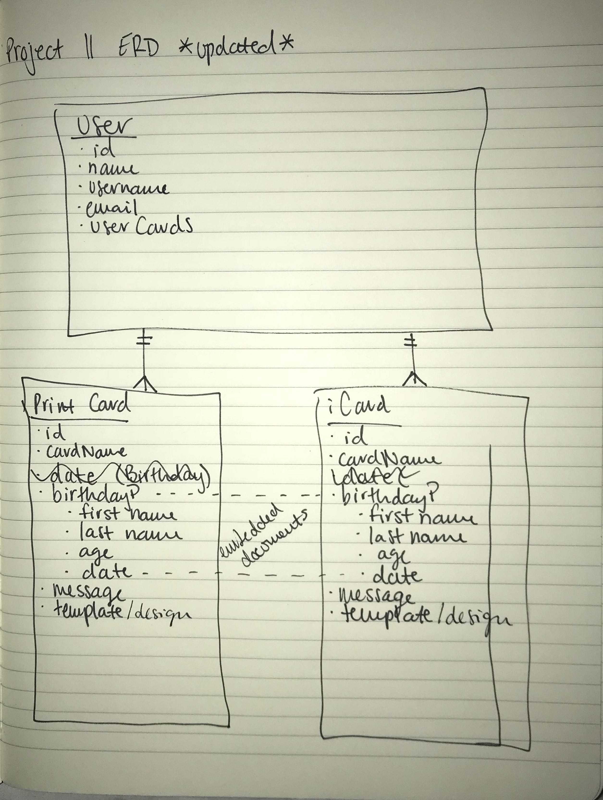
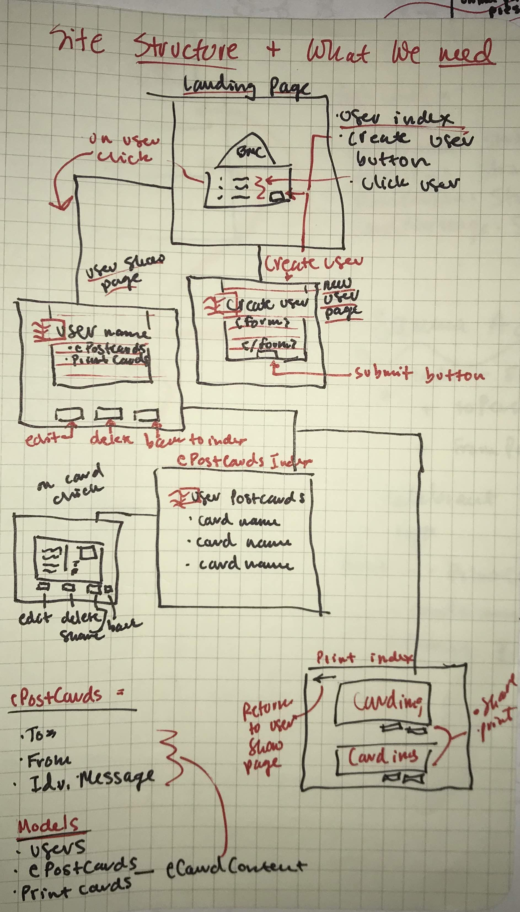

# Project Two: Bare Minimum Cards

This project is for an online printing press named 'Bare Minimun Cards'. On the website the client will be able to create online postcards for everyday life situations. There will be a field to enter information to create an ePostCard and also a library of Printable cards.

In version two I am going to add eCard occasion templates, adjust styling and display actual printable cards.

## ERD

## WIREFRAMES

## GITHUB LINK
https://github.com/grantspell/project_two

## TRELLO BOARD
https://trello.com/b/jWhE7YCi/project-ii-bmc

## HEROKU LINK
https://agile-caverns-43314.herokuapp.com/